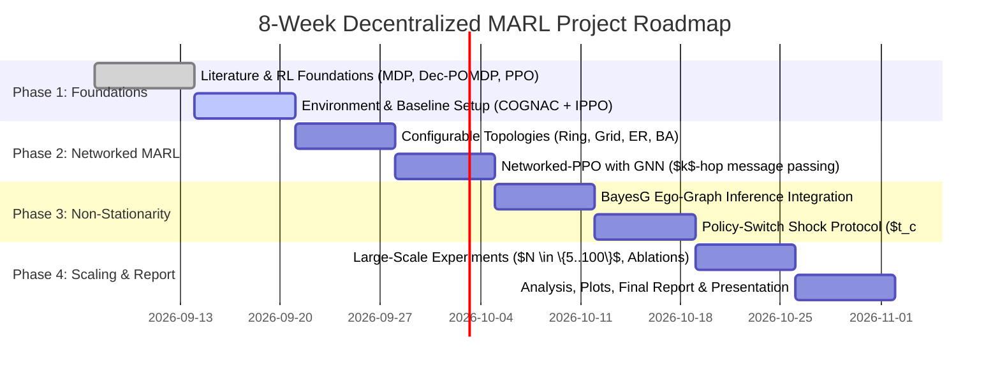

# Decentralized MARL for Networked Agents under Non-Stationarity: Project Plan & 2-Month Roadmap

## Project Overview
This project investigates how decentralized reinforcement learning agents situated on networked graph topologies can learn and adapt cooperative policies in the presence of **non-stationarity**—specifically when neighboring agents' policies shift concurrently or abruptly during training. 

By combining **COGNAC** (NeurIPS 2025 benchmark for configurable graph topologies) and **BayesG** (NeurIPS 2025 Bayesian ego-graph inference for networked MARL), this project studies how stability, convergence, communication efficiency, and adaptation degrade or recover across:
1. **Agent scales**: \(N \in \{5, 10, 25, 50, 100\}\)
2. **Network topologies**: Ring, 2D Grid, Erdős-Rényi Random, Barabási-Albert Scale-Free
3. **Communication radii**: \(k \in \{1, 2, 3\}\) hops vs. learned Bayesian sparse ego-graphs
4. **Non-stationarity shocks**: Mid-training policy switching (\(t < t_c: \pi_A, t \ge t_c: \pi_B\)) across varying fractions and topological roles (e.g., hub vs. peripheral nodes)

---

## User Review Required

> [!IMPORTANT]
> **GitHub Repository Creation & Git Config**:
> - We detected your authenticated GitHub account: **`VyomChovatiya`**.
> - Proposed Repository Name: **`networked-marl-nonstationarity`** (Alternative: `decentralized-marl-networked-agents`).
> - Visibility: **Public** or **Private** (we recommend **Public** or **Private with GitHub student benefits**).
> - Commit Author Name & Email: We can configure `git config user.name "Vyom Chovatiya"` and your GitHub noreply email `178585666+VyomChovatiya@users.noreply.github.com` (or your personal academic email if you prefer).

> [!TIP]
> **Python Environment Recommendation**:
> - Your machine runs CachyOS with an **NVIDIA GeForce RTX 5070 Laptop GPU (8GB VRAM)** and CUDA 13.3.
> - System Python is Python 3.14, which is too new for standard PyTorch/PyG wheels (which target Python 3.10–3.12).
> - We recommend using **`uv`** (installed cleanly in your user space `~/.local/bin`) to manage an isolated **Python 3.11** virtual environment (`.venv`). This requires zero root/sudo permissions and installs PyTorch + CUDA in seconds.

---

## Open Questions

> [!NOTE]
> Please indicate your preferences for:
> 1. **GitHub Visibility**: Do you prefer the GitHub repository to be **Public** or **Private**?
> 2. **Git Commit Email**: Should we use the GitHub noreply address (`178585666+VyomChovatiya@users.noreply.github.com`) or a specific university/personal email?
> 3. **Primary Benchmark Environment in COGNAC**: COGNAC provides *Binary Consensus* (voter model on arbitrary graphs) and *SysAdmin* (machine network maintenance). We propose starting with **Binary Consensus** because it directly isolates coordination over arbitrary graphs before testing **SysAdmin**. Does this order sound good?

---

## 8-Week Progressive Roadmap (2-Month Plan for College Student)

The roadmap is structured specifically for a student building up expertise from foundational concepts to research-grade empirical contributions.



### Phase 1: Foundations & Quickstart (Weeks 1–2)
- **Week 1: Core Concept Mastery & Environment Setup**
  - **Concepts**: Single-agent RL (MDP, Policy Gradient, PPO) $\to$ MARL (Dec-POMDP, Centralized Training vs Decentralized Execution).
  - **Milestone 1**: Git repo created & pushed to GitHub; isolated Python 3.11 environment working with GPU PyTorch.
  - **Milestone 2**: Interactive Jupyter notebook demonstrating a toy 2-agent Dec-POMDP to observe non-stationarity in real time.
- **Week 2: COGNAC Benchmark & IPPO Baseline**
  - **Concepts**: The COGNAC suite; Independent PPO (IPPO) where each agent treats other agents as part of the environment.
  - **Milestone 3**: Run IPPO on COGNAC's Binary Consensus environment on a 5-node ring. Log reward curves to TensorBoard/Wandb.

### Phase 2: Graph Topologies & Networked Communication (Weeks 3–4)
- **Week 3: Topology Generator & Graph Metrics**
  - **Concepts**: Graph theory in MARL: Adjacency matrices, spectral gap, graph diameter, degree distribution.
  - **Milestone 4**: Implement modular network generators (`src/environments/graphs.py`):
    - **Ring Graph**: High diameter $O(N)$, slow information propagation.
    - **2D Grid**: Planar local lattice, diameter $O(\sqrt{N})$.
    - **Erdős-Rényi (ER)**: Homogeneous random graph, small diameter.
    - **Barabási-Albert (BA)**: Scale-free power-law network with hubs (mimics real communication/infrastructure networks).
- **Week 4: Networked Actor-Critic with $k$-Hop GNN Communication**
  - **Concepts**: Graph Convolutional Networks (GCN) and Graph Attention (GAT) for local observation exchange over $k \in \{1, 2, 3\}$ hops.
  - **Milestone 5**: Benchmark IPPO (0-hop) vs Networked-GNN ($k$-hop) across all 4 topologies with $N=10$ and $N=25$.

### Phase 3: Non-Stationarity & Bayesian Ego-Graph Inference (Weeks 5–6)
- **Week 5: The Policy-Switch Non-Stationarity Protocol**
  - **Concepts**: Why simultaneous learning induces non-stationarity, and how sudden behavioral shifts disrupt coordination.
  - **Milestone 6**: Implement experimental shock generator:
    - At training step $t_c$, switch policy of a subset of agents ($\rho \in \{0.2, 0.5, 0.8\}$) from cooperative policy $\pi_A$ to perturbed/adversarial/stochastic policy $\pi_B$.
    - Measure post-shock recovery time (**adaptation speed**) and loss of return (**instability index**).
- **Week 6: BayesG (Bayesian Ego-Graph Inference)**
  - **Concepts**: Variational Inference, Gumbel-Softmax / Concrete latent masks $Z_i \in \{0, 1\}^{|V_i|}$, Evidence Lower Bound (ELBO).
  - **Milestone 7**: Integrate BayesG ego-graph inference to learn sparse, dynamic edge masks. Show that BayesG dynamically cuts off corrupted/shifted neighbors during the non-stationarity shock!

### Phase 4: Systematic Scaling, Analysis & Deliverables (Weeks 7–8)
- **Week 7: Sweeps Across All Dimensions**
  - Vary $N \in \{5, 10, 25, 50, 100\}$.
  - Compare **IPPO vs. Static $k$-hop GNN vs. BayesG**.
  - Measure 6 core metrics:
    1. *Convergence Speed* (steps to 90% asymptotic return)
    2. *Final Joint Reward*
    3. *Instability Index* (variance of returns over rolling sliding window)
    4. *Adaptation Speed* (timesteps to recover after $t_c$)
    5. *Communication Overhead* (active edges / messages passed)
    6. *Scalability* (wall-clock time and VRAM usage vs $N$)
- **Week 8: Report, Visualizations & Presentation**
  - Generate publication-quality plots (returns, radar charts of communication vs reward, heatmaps of topology vs stability).
  - Write final academic project report & slide deck.

---

## Proposed Codebase Architecture

Grouped by component:

### 1. Repository Infrastructure & Documentation
- [NEW] `.gitignore` — Ignore caches, checkpoints, logs, virtual environments.
- [NEW] `README.md` — Project description, mathematical formulation, setup guide, execution instructions.
- [NEW] `ROADMAP.md` — Week-by-week curriculum, reading guide, and milestones for the student.
- [NEW] `pyproject.toml` / `requirements.txt` — Core dependencies (`torch`, `cognac`, `networkx`, `scipy`, `matplotlib`, `seaborn`, `tensorboard`, `pyyaml`).

---

### 2. Environment & Graph Topologies (`src/environments/`)
- [NEW] `src/environments/__init__.py`
- [NEW] `src/environments/graphs.py` — NetworkX graph generators for Ring, 2D Grid, Erdős-Rényi, and Barabási-Albert with normalized adjacency and Laplacian matrices.
- [NEW] `src/environments/cognac_wrapper.py` — PettingZoo/Gymnasium-compatible wrapper around COGNAC (Binary Consensus & SysAdmin), parameterizing arbitrary topologies and node attributes.

---

### 3. Models & GNN Layers (`src/models/`)
- [NEW] `src/models/__init__.py`
- [NEW] `src/models/actors.py` — Decentralized MLP and Graph-conditioned actor policies.
- [NEW] `src/models/critics.py` — Local decentralized critic & networked critic.
- [NEW] `src/models/gnn_comm.py` — $k$-hop message passing layers (GCN/GAT) for exchanging neighborhood features.
- [NEW] `src/models/bayes_ego.py` — BayesG latent ego-graph variational inference module (predicting stochastic edge masks $Z_i$ via Gumbel-Softmax with ELBO loss).

---

### 4. Algorithms (`src/algorithms/`)
- [NEW] `src/algorithms/__init__.py`
- [NEW] `src/algorithms/ippo.py` — Independent PPO baseline (no communication).
- [NEW] `src/algorithms/networked_ppo.py` — Static $k$-hop GNN communication actor-critic.
- [NEW] `src/algorithms/bayesg.py` — BayesG algorithm: joint policy optimization + latent graph inference via ELBO.

---

### 5. Non-Stationarity Protocols & Experiment Runners (`src/experiments/`)
- [NEW] `src/experiments/__init__.py`
- [NEW] `src/experiments/shock_protocol.py` — Controller that triggers policy switches ($\pi_A \to \pi_B$) at step $t_c$ for selected subsets of nodes (random, hubs, or boundary nodes).
- [NEW] `src/experiments/run_experiment.py` — Config-driven experiment runner.
- [NEW] `configs/default.yaml` — Base hyperparameters (learning rate, discount factor, PPO clip, batch sizes).
- [NEW] `configs/scaling_sweep.yaml` — Config matrix for $N \in \{5, 10, 25, 50, 100\}$, topologies, and radii.

---

### 6. Evaluation, Metrics & Plotting (`src/evaluation/`)
- [NEW] `src/evaluation/__init__.py`
- [NEW] `src/evaluation/metrics.py` — Computation of return, convergence rate, instability index (variance), adaptation latency, and communication cost.
- [NEW] `src/evaluation/plot_results.py` — Matplotlib/Seaborn visualization scripts for publication-quality learning curves and comparative bar charts.

---

### 7. Educational Notebooks (`notebooks/`)
- [NEW] `notebooks/01_marl_foundations.ipynb` — Tutorial on Dec-POMDP, non-stationarity, and running the first 5-agent simulation.

---

## Verification Plan

### Automated Tests
1. **Graph Topologies**: Verify graph generator produces connected graphs with correct node counts, edge distributions, and adjacency shapes:
   ```bash
   python -m pytest tests/test_graphs.py
   ```
2. **Environment Step**: Verify COGNAC environment wrapper steps correctly for $N \in \{5, 10, 25, 50, 100\}$:
   ```bash
   python -m pytest tests/test_env.py
   ```
3. **Model Forward & Backward Pass**: Verify PyTorch forward/backward pass for IPPO, Networked GNN, and BayesG modules on RTX 5070 GPU:
   ```bash
   python -m pytest tests/test_models.py
   ```
4. **End-to-End Smoke Test**: Run 100 training steps with policy-switch shock on a 5-node ring:
   ```bash
   python src/experiments/run_experiment.py --config configs/smoke_test.yaml
   ```

### Manual Verification & GitHub Integration
- Verify git repository initialization, commit history, and remote tracking on GitHub (`gh repo view VyomChovatiya/networked-marl-nonstationarity`).
- Verify TensorBoard logs show reward curves, policy entropy, and ELBO loss without memory leaks on the RTX 5070.
